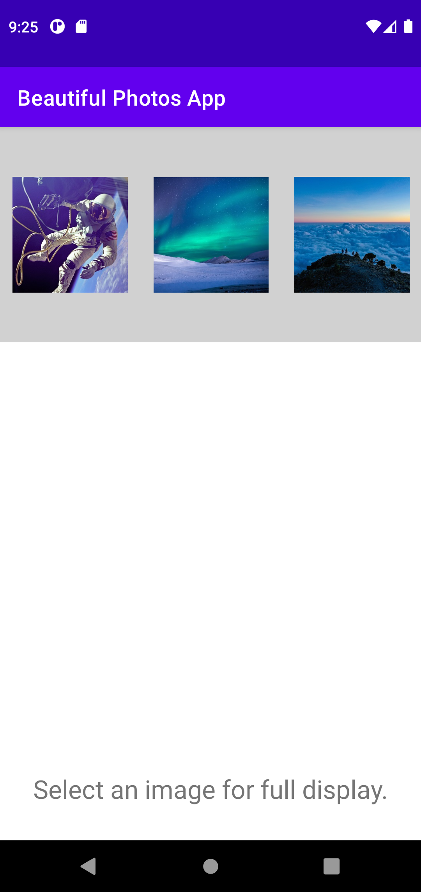
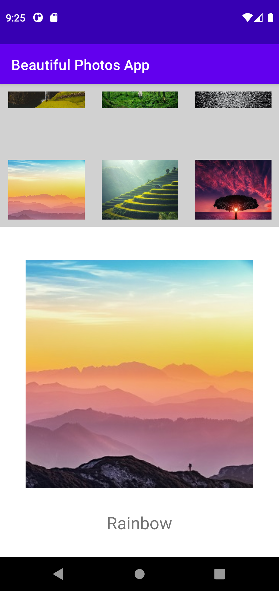

# Lab 3
* Image Recycler View App
* For Mobile Application Development

## Synopsis:
* Create a working app using RecyclerView to display an image with its selected text

## Screenshots:

## Commits:
Total commits: 12
Last commit made: September 29, 2021

## Image Sources:
* https://www.pexels.com/photo/snow-sea-dawn-landscape-6043246/
* https://www.pexels.com/photo/person-walking-between-green-forest-trees-15286/
* https://www.pexels.com/photo/silhouette-of-tree-near-body-of-water-during-golden-hour-36717/ 
* https://www.pexels.com/photo/scenic-view-of-rice-paddy-247599/
* https://www.pexels.com/photo/scenic-view-of-dramatic-sky-during-winter-258112/
* https://www.pexels.com/photo/silhouette-of-mountains-1323550/
* https://www.pexels.com/photo/desert-under-blue-sky-210307/
* https://www.pexels.com/photo/white-and-black-moon-with-black-skies-and-body-of-water-photography-during-night-time-748626/
* https://www.pexels.com/photo/man-standing-on-cliff-watching-punch-bowl-waterfalls-1402850/
* https://www.pexels.com/photo/brown-bull-on-green-glass-field-under-grey-and-blue-cloudy-sky-139399/
* https://www.pexels.com/photo/astronaut-astronomy-cosmonaut-galaxy-355956/
* https://www.pexels.com/photo/scuba-diver-under-water-4666754/
